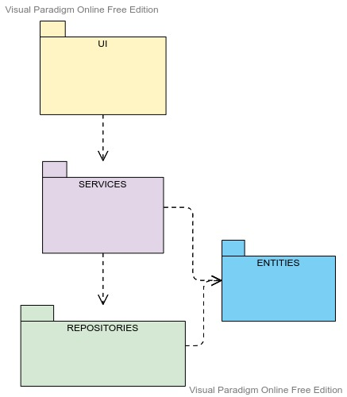
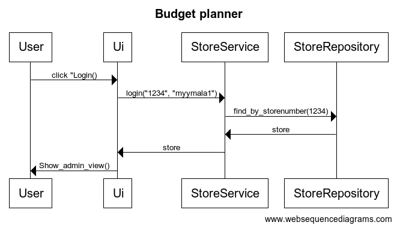
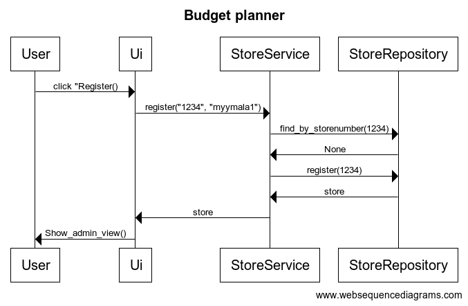
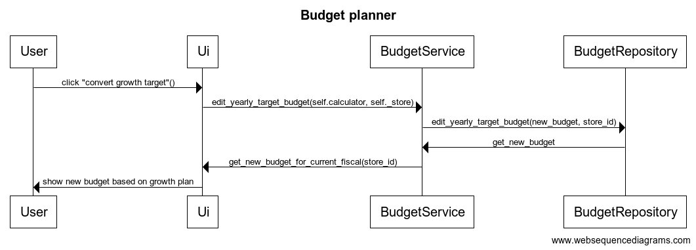

## Arkkitehtuurikuvaus

#### Rakenne

Ohjelmassa on käytetty kerrosarkkitehtuuria, jossa ohjelma on jaettuna kolmeen tasoon. Kerroksien välisiä suhteita on havainnollistettu pakkauskaaviolla:

UI-luokka vastaa käyttöliittymästä ja sisältää siihen liittyvän koodin. Services vastaa sovelluslogiikasta. Repositories-luokka vastaa tietojen tallennuksesta sekä hakemisesta tietokannasta.

#### Käyttöliittymä

Käyttöliittymässä on neljä eri näkymää:
- Kirjautuminen
- Rekisteröityminen
- Näkymä jossa asetetaan vuoden tavoitteet
- Näkymä jossa voi muokata avainlukuja

Näistä kaikista vastaa UI- luokka.

#### Tietojen tallennus

Pakkauksessa repositories sijaitsevat StoreRepository sekä BudgetRepository luokat. Ne vastaavat datan tallentamisesta SQLite tietokantaan.

#### Päätoiminnallisuudet

Alla sekvenssikaaviot selkiyttämään sovelluksen toimintalogiikkaa.

##### Sisäänkirjautuminen jos olemassa oleva myymälä

Ohjelman ensimmäinen näkymä on login näkymä jossa myymälä voi kirjautua sisään olemassa olevilla tunnuksilla. Sekvenssikaaviossa on kuvattu miten sovelluksen kontrolli etenee kun käyttäjä painaa login nappulaa.

##### Rekisteröitymin jos uusi käyttäjä

Jos käyttäjällä ei ole rekisteristä löytyvää myymälätunnusta, hän voi kirjautua sisään klikkaamalla etusivulla register painiketta joka ohjaa käyttäjän register näkymään. Siellä hän voi luoda itselleen myymälänumeron ja salasanan antamalla tunnuksen. Silloin kontrolli etenee seuraavasti.

##### Vuosibudjetin tavoitteen asettaminen

Kun käyttäjä on admin_view sivulla, hän näkee edellisen tuloskauden toteutuneen myynnin. Sen pohjalta hän voi suunnitella tulevan tuloskauden tavoitteita kokeilemalla eri kasvuprosenttilukuja ikkunaan ja painamalla confirm painiketta. Silloin ruudulle ilmestyy seuraavan tuloskauden budjetti käyttäjän asettaman kasvutavoitteen mukaisesti ja tietokantaan lähtee siitä tieto mitä hyödynnetään seuraavan näkymän avainlukutavoitteiden luomisessa.
Kontrolli etenenee näin

