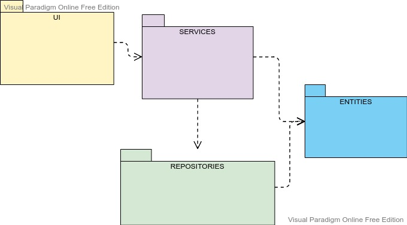

## Arkkitehtuurikuvaus

#### Rakenne

Ohjelmassa on käytetty kerrosarkkitehtuuria, jossa ohjelma on jaettuna kolmeen tasoon. Kerroksien välisiä suhteita on havainnollistettu pakkauskaaviolla:

UI-luokka vastaa käyttöliittymästä ja sisältää siihen liittyvän koodin. Services vastaa sovelluslogiikasta. Repositories-luokka vastaa tietojen tallennuksesta sekä hakemisesta tietokannasta.

#### Käyttöliittymä

Käyttöliittymässä on neljä eri näkymää:
- Kirjautuminen
- Rekisteröityminen
- Näkymä jossa asetetaan vuoden tavoitteet
- Näkymä jossa voi muokata avainlukuja

Näistä kaikista vastaa UI- luokka.

